# PetCareHub

PetCareHub 是一個創新的全端解決方案，旨在簡化和優化寵物照護任務管理。它整合了 Laravel API 後端、Vue 3 網頁前端、Flutter 行動應用程式以及 Flask AI 推薦微服務，幫助飼主輕鬆規劃、記錄並透過智慧建議提升每日寵物照護的效率與體驗。

---

## 主要亮點

- **AI 驅動推薦**  
  利用 Flask 微服務分析飼主行為與寵物狀況，動態生成最優化的照護建議與排程，讓您不再為寵物健康煩惱。

- **多端同步**  
  以 Laravel REST API 為核心，統一管理資料與業務邏輯。Vue 3 提供直觀易用的網頁 Dashboard；Flutter 原生 App 支援 iOS/Android，讓您隨時隨地掌握照護進度，享受無縫體驗。

- **模組化微服務架構**  
  各職責服務獨立部署並採用 Docker 容器化管理，提供卓越的彈性擴展性與維護效率。

- **CI/CD 與自動化測試**  
  整合 GitHub Actions 實現自動化建構、測試與部署流程，確保每次更新的品質穩定與交付可靠。

- **事件驅動與訊息佇列**  
  利用 RabbitMQ（或 Kafka）串聯各微服務，實現非同步處理通知、排程與數據分析，大幅提升系統的可擴展性與穩定度。

---

## 核心功能

- 任務排程與提醒  
- 照護記錄與歷史查詢  
- AI 建議：餵食量、洗澡頻率、運動時長  
- 團隊協作：多帳號支援與權限控管  
- API 文件：完整 OpenAPI/Swagger 規範

---

## 請求與回應流程

以下示意從用戶端到 AI 微服務再回到用戶端的完整資料流，讓流程更清晰。

```mermaid
flowchart LR
    %% 用戶端
    subgraph CLIENTS ["用戶端"]
        A1["📱 Flutter App"]
        A2["🖥️ Vue 3 Web UI"]
    end

    %% API Gateway
    subgraph GATEWAY ["API Gateway (Nginx)"]
        B["🔗 Nginx"]
    end

    %% 主後端服務
    subgraph BACKEND ["主後端服務"]
        C["🎯 Laravel API"]
        D["🗄️ MySQL"]
        E["⚡ Redis"]
        F["📬 RabbitMQ"]
    end

    %% AI 微服務
    subgraph AI_SERVICE ["AI 微服務"]
        G["🧠 Flask AI Service"]
    end

    %% 資料流
    A1 -->|1️⃣ 發送請求| B
    A2 -->|1️⃣ 發送請求| B
    B -->|2️⃣ 路由至 API| C

    C -->|3️⃣ 查詢資料庫| D
    C -->|3️⃣ 查詢快取| E
    C -->|3️⃣ 發送任務訊息| F

    C -->|4️⃣ 呼叫 AI 建議| G
    G -->|5️⃣ 回傳建議結果| C

    C -->|6️⃣ 組裝 JSON 回應| B
    B -->|7️⃣ 回傳結果| A1
    B -->|7️⃣ 回傳結果| A2


```



- Step 1：用戶端發起請求（例如「取得任務列表」）。  
- Step 2：Nginx 作為 Gateway，處理 SSL、CORS，並將請求路由到 Laravel API。  
- Step 3：Laravel API 執行核心邏輯，可能讀取資料庫、快取或放入訊息佇列。  
- Step 4：若需要智慧建議，Laravel API 再呼叫 Flask AI 微服務。  
- Step 5：AI 服務運算完成，將推薦結果回傳給 Laravel API。  
- Step 6：Laravel API 封裝所有資料後，將 JSON 回應送回 Nginx。  
- Step 7：Nginx 將最終結果回傳給原始用戶端，前端框架接收後更新畫面。

---

## 技術棧

- 後端 API：Laravel (PHP)  
- 網頁前端：Vue 3 + Pinia + Vite  
- 行動端：Flutter + Dart  
- AI 推薦：Flask (Python) + Scikit-learn / LightGBM  
- 容器化：Docker & Docker Compose  
- 訊息佇列：RabbitMQ / Kafka  
- CI/CD：GitHub Actions  
- 資料庫：MySQL / PostgreSQL

---

## 如何啟動專案（推薦使用 Docker Compose）

### 前置條件

- Docker Desktop（含 Docker Engine & Docker Compose）  
- Git  
- Flutter SDK（僅開發或運行 App 時需安裝）

### 步驟說明

1. Clone 專案
   - `git clone https://github.com/BpsEason/petcarehub.git`
   - `cd petcarehub`

2. 設定環境變數
   - Laravel 後端：  
     `cp backend/.env.example backend/.env`
   - Vue 前端：  
     `cp frontend/.env.local.example frontend/.env.local`

3. 啟動所有服務  
   `docker-compose up -d --build`  
   - `-d`：後台分離模式  
   - `--build`：強制重建映像檔

4. 安裝依賴並執行遷移（Laravel API）  
   - `docker-compose exec laravel-api composer install`  
   - `docker-compose exec laravel-api php artisan key:generate`  
   - `docker-compose exec laravel-api php artisan migrate --force`

5. 安裝依賴並啟動開發伺服器（Vue 前端）  
   - `docker-compose exec vue-frontend npm install`  
   - `docker-compose exec vue-frontend npm run dev`

6. 安裝依賴（Flask AI 服務）  
   - `docker-compose exec python-ai pip install -r requirements.txt`

7. 運行行動 App  
   - `cd flutter_app`  
   - `flutter pub get`  
   - `flutter run`  
   確保 `lib/config.dart` 中的 `apiBaseUrl` 和 `aiServiceUrl` 指向 Docker 映射的端口。

---

## 服務訪問

- Web 前端： http://localhost  
- Laravel API： http://localhost/api/v1  
- AI 服務：  http://localhost/ai  
- MySQL：    localhost:3306  
- Redis：    localhost:6379  

---

## 停止服務

`docker-compose down`  
若要保留資料卷，請移除 `-v` 或 `--volumes` 參數。

---

## 手動安裝與執行 PetCareHub（不使用 Docker Compose）

若無需容器化，可依下列步驟分別啟動各服務。

### 1. 取得原始碼

`git clone https://github.com/BpsEason/petcarehub.git`  
`cd petcarehub`

### 2. Laravel API

```bash
cd backend
cp .env.example .env
# 編輯 .env 設定資料庫連線與 APP_URL
composer install
php artisan key:generate
php artisan migrate --seed
php artisan serve --host=127.0.0.1 --port=8000
```

### 3. Vue 3 前端

```bash
cd frontend
npm install
# 設定 API 位址於 .env.local：VITE_API_URL=http://localhost:8000/api/v1
npm run dev
```

### 4. Flask AI 微服務

```bash
cd ai-service
python3 -m venv venv
source venv/bin/activate
pip install -r requirements.txt
# 可選：編輯 .env 填入資料庫 URI、SECRET_KEY
flask run --host=127.0.0.1 --port=5000
```

### 5. Flutter 行動 App

```bash
cd flutter_app
flutter pub get
# 編輯 lib/services/api_service.dart 更新 baseUrl
flutter run
```

---

## 開發指南

### 測試

- **Laravel**  
  `docker-compose exec laravel-api php artisan test`  
  或本地：`php artisan test`  
  重要測試：`backend/tests/Feature/PetApiTest.php`、`CareTaskApiTest.php`

- **Vue 前端**  
  `docker-compose exec vue-frontend npm run test:unit`  
  或本地：`cd frontend && npm run test:unit`  
  重要測試：Pinia Store、元件渲染、路由行為

- **Flask AI**  
  `docker-compose exec python-ai pytest`  
  或本地：`cd ai-service && source venv/bin/activate && pytest`  
  重要測試：`test_app.py` 中的推薦邏輯

- **Flutter**  
  `cd flutter_app && flutter test`  
  包含 Widget、ApiService 與整合測試範例

---

## 持續整合與部署（CI/CD）

根據 `.github/workflows/main.yml` 設定，GitHub Actions 將負責各服務的建置、測試與自動化部署。您可依需求擴展此工作流，例如推送 Docker 映像至容器註冊表或部署至生產環境。

---

## 關於空目錄與 Git 追蹤

專案中部分空目錄（如 `backend/app/Console`、`flutter_app/lib/api`）已加入 `.gitkeep`，用於強制 Git 追蹤資料夾。請勿隨意移除，除非確認目錄不再需要版本控制。

---

## 貢獻與支持

歡迎透過 Issue 或 Pull Request 回報問題、提出功能建議或直接貢獻程式碼。一起打造更完善的 PetCareHub！
